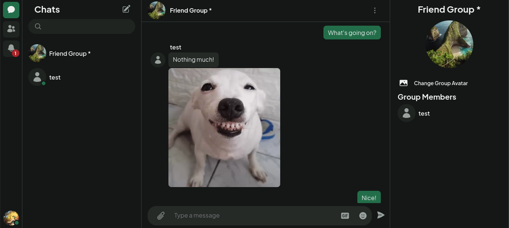

<div id="top" />


<h2 align="center"><a href="https://metzinger.onrender.com/">Click for Live Demo</a></h2>

**Tantan** is a chat application that implements most of the features one would expect ranging from image uploads to gifs to emojis. 

### Table of Contents

- [About the Project](#about)
  - [Technologies](#technologies)
  - [Features](#features)
- [Screenshots](#screenshots)
- [Getting Started](#getting_started)
  - [Prerequisites](#prerequisites)
  - [Installation](#installation)
- [Contributing](#contributing)
- [License](#license)

<p align="right">(<a href="#top">back to top</a>)</p>

## About the Project <a name="about"></a>

### Technologies <a name="technologies"></a>

[![Typescript][typescript]][typescript-url] 
[![React][react.js]][react-url] 
[![React Query][react-query]][react-query-url] 
[![Socket.io][socket-io]][socket-io-url] 
[![PostgreSQL][postgresql]][postgresql-url]

### Features <a name="features"></a>

- Send real-time messages with a friend, or find users to chat with
- Choose to send text messages, images under 2mb, or gifs
- Chat with more than one user at a time with group chat

<p align="right">(<a href="#top">back to top</a>)</p>

## Screenshots <a name="screenshots"></a>




<p align="right">(<a href="#top">back to top</a>)</p>

## Getting Started <a name="getting_started"></a>

### Prerequisites <a name="prerequisites"></a>

Create an .env file in the client folder, and enter fields as such:

```
VITE_SERVER_URL = [base url for your server here]
VITE_TENOR_API_KEY = [api key from google cloud console]
VITE_TENOR_CLIENT_KEY = [custom client key you make up]
```

Then, create an .env.local file in the server folder, and input your API key as such:

```
CLOUDINARY_CLOUD_NAME = [cloud name provided by cloudinary]
CLOUDINARY_API_KEY = [your cloudinary api key]
CLOUDINARY_API_SECRET = [your cloudinary api secret]
CLIENT_URL = [base url of client]
PORT = [port you want server to run on]
SESSION_SECRET = [custom secret for sessions]
PGHOST=[postgres host name]
PGUSER=[postgres user]
PGDATABASE=[name of postgres database]
PGPASSWORD=[password for postgres user]
PGPORT=[port postgres is running on]
```

### Installation <a name="installation"></a>

Clone the repo and install through your method of choice.

```
$ git clone https://github.com/justinpv98/metzinger-ecommerce.git
$ cd metzinger-ecommerce
$ npm install
```

Run a development server.

```
$ cd client
$ npm run dev

$ cd server
$ npm run dev
```

<p align="right">(<a href="#top">back to top</a>)</p>

## Contributing <a name="contributing"></a>

Contributions, issues and feature requests are welcome.
<p align="right">(<a href="#top">back to top</a>)</p>

## License <a name="license"></a>

Distributed under the MIT License. See `LICENSE` for more information.

<p align="right">(<a href="#top">back to top</a>)</p>

<!-- LINKS -->


[react.js]: https://img.shields.io/badge/react-20232A?style=for-the-badge&logo=react&logoColor=61DAFB
[react-url]: https://reactjs.org/
[typescript]: https://img.shields.io/badge/typescript-3178C6?style=for-the-badge&logo=typescript&logoColor=white
[typescript-url]: https://www.typescriptlang.org/
[socket-io]: https://img.shields.io/badge/socket.io-010101?style=for-the-badge&logo=socket.io&logoColor=white
[socket-io-url]: https://socket.io/
[react-query]: https://img.shields.io/badge/react_query-002C4B?style=for-the-badge&logo=reactquery&logoColor=FF4154
[react-query-url]: https://tanstack.com/query/v4/docs/overview
[postgresql]: https://img.shields.io/badge/postgresql-4169E1?style=for-the-badge&logo=postgresql&logoColor=white
[postgresql-url]: https://www.postgresql.org/